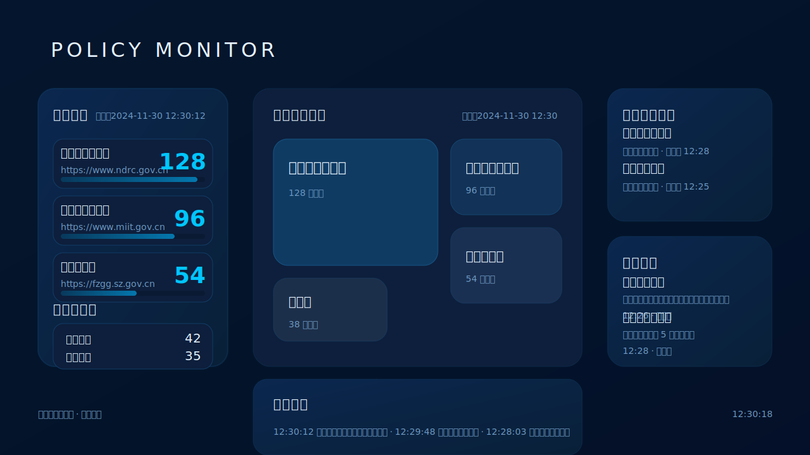
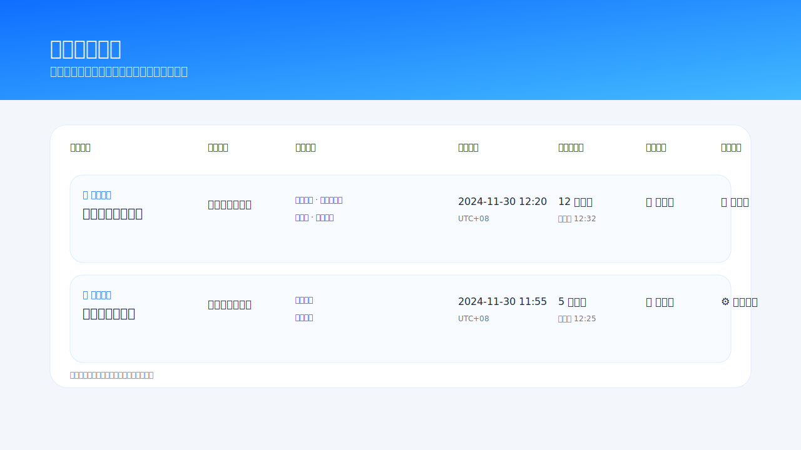
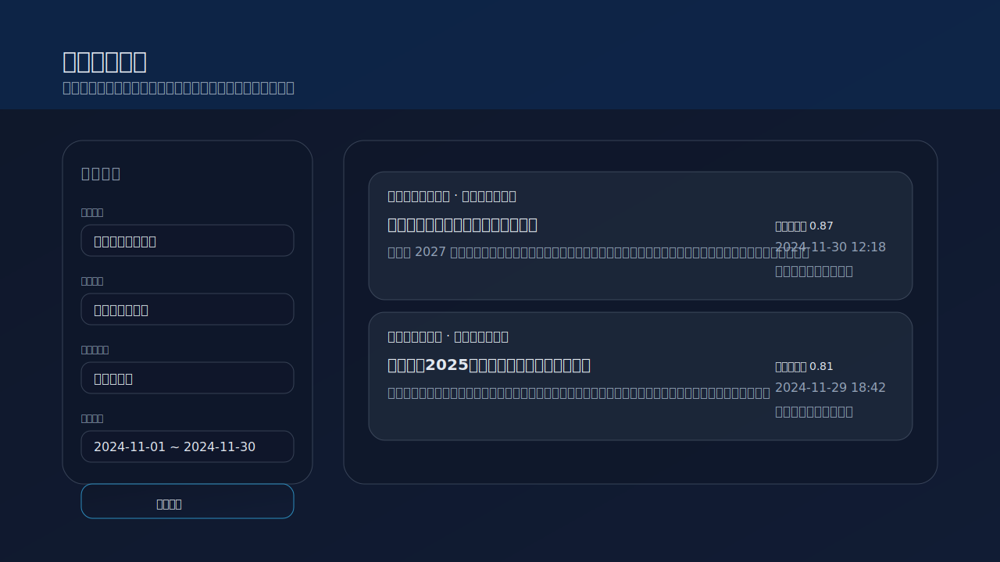
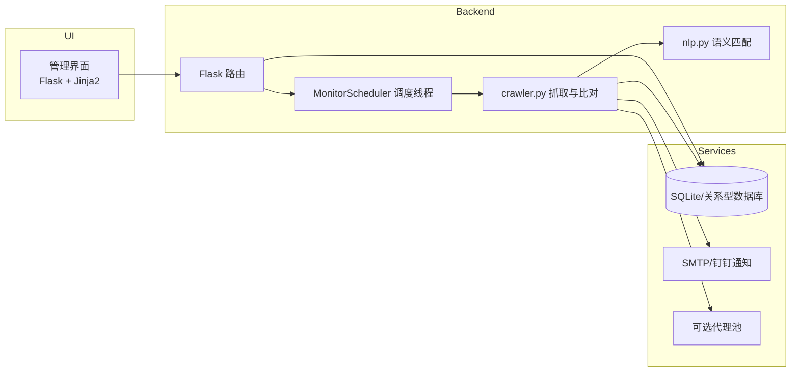

# 政策监控平台（Policy Monitor）

一个可配置的政策信息监控平台，支持多站点抓取、智能匹配与通知推送，帮助团队快速洞察政策动态、形成结构化的监测闭环。

## 功能预览

| 驾驶舱总览 | 任务编排 | 结果归档 |
| --- | --- | --- |
|  |  |  |

> 上图展示了平台核心页面的视觉示意：驾驶舱实时汇总监测概况、任务中心支持精细化调度、结果归档聚合命中内容以便复核与追踪。

## 核心功能

- **关注网站管理**：支持站点基础配置、选择是否抓取子页面、配置抓取频率与代理策略。
- **关注内容与分类**：以关键词或摘要的形式维护监控重点，可按分类复用到多个任务。
- **监控任务编排**：将站点、关注内容、通知渠道组合成任务，可启停、查看日志与运行状态。
- **抓取与比对引擎**：自动检测页面新增链接、解析内容摘要，并依据语义相似度命中政策资讯。
- **多渠道通知**：内置 SMTP 邮件发送，并预留钉钉 webhook 扩展能力。
- **驾驶舱与可视化**：提供高对比度驾驶舱，展示站点贡献度、执行队列、实时日志等指标。

## 技术亮点

- **Flask + SQLAlchemy**：轻量稳定的 Web/ORM 组合，便于快速二次开发与迁移。
- **可插拔的 NLP 匹配**：优先使用 `sentence-transformers`（`all-MiniLM-L6-v2`），在缺少依赖时自动回退到模糊匹配。
- **后台调度器**：`MonitorScheduler` 在应用内常驻线程调度抓取任务，并支持运行时热加载代理配置。
- **可观测性设计**：抓取日志、通知日志、监测结果全部结构化入库，可通过 UI 或自定义 SQL 复盘。
- **代理与节流**：内建代理池管理与请求节流，适配受限站点访问策略。

## 架构一览



## 目录结构

```
.
├── app.py                 # Flask 应用入口与路由
├── crawler.py             # 抓取、对比与通知逻辑
├── database.py            # 数据库会话及环境变量覆盖支持
├── email_utils.py         # SMTP/钉钉通知封装
├── models.py              # SQLAlchemy 模型定义
├── scheduler.py           # 后台调度器
├── templates/             # 前端模板（管理界面与驾驶舱）
├── docs/images/           # 功能示意图资源
├── docs/previews/         # HTML 预览（截图用演示数据）
├── requirements.txt       # Python 依赖列表
└── Dockerfile             # Docker 构建脚本
```

## 快速开始（开发模式）

1. **创建虚拟环境并安装依赖**

   ```bash
   python3 -m venv .venv
   source .venv/bin/activate  # Windows 使用 .venv\Scripts\activate
   python -m pip install --upgrade pip
   python -m pip install -r requirements.txt
   ```

   如需启用语义匹配模型，确保能够安装 `sentence-transformers` 所需依赖（部分 Python 版本暂未提供预编译轮子）。

2. **配置通知渠道**

   在环境变量或 `app.py` 中配置以下 SMTP 变量：

   - `SMTP_HOST`
   - `SMTP_PORT`
   - `SMTP_USERNAME`
   - `SMTP_PASSWORD`
   - `SMTP_USE_TLS`（可选，默认 `true`）
   - `SMTP_SENDER`（可选，默认与用户名一致）

   若使用钉钉 webhook，参考 `email_utils.py` 内的 `send_dingtalk_message`。

3. **启动服务**

   ```bash
   python -m flask --app app run
   ```

   首次启动会自动初始化数据库、导入示例代理并启动调度器。

4. **访问管理界面**

   浏览器打开 [http://localhost:5000](http://localhost:5000) 即可开始配置站点、关键词与监控任务。

## Docker 部署

1. **准备运行目录**（用于持久化数据库与上传文件）：

   ```bash
   mkdir -p runtime/data runtime/uploads
   ```

2. **构建镜像**

   ```bash
   docker build -t policy-monitor:latest .
   ```

3. **运行容器**

   ```bash
   docker run -d \
     --name policy-monitor \
     -p 5000:5000 \
     -e FLASK_ENV=production \
     -e DATABASE_URL=sqlite:////data/data.db \
     -e SMTP_HOST=smtp.example.com \
     -e SMTP_PORT=465 \
     -e SMTP_USERNAME=notify@example.com \
     -e SMTP_PASSWORD=secret \
     -e SMTP_USE_TLS=true \
     -v $(pwd)/runtime/data:/data \
     -v $(pwd)/runtime/uploads:/uploads \
     policy-monitor:latest
   ```

   - `/data` 卷用于保存 `data.db` 等数据库文件。
   - `/uploads` 卷可用于扩展存储附件、报告或快照等文件。
   - 如需暴露其他服务端口（例如自定义 API），可在 `docker run` 时追加 `-p` 参数。

4. **日志与升级**

   - 查看运行日志：`docker logs -f policy-monitor`
   - 升级版本：停止并删除旧容器，重新构建镜像并挂载同一数据卷即可保留历史数据。

## 运维提示

- 若运行环境无法安装 `sentence-transformers`，系统会退回到模糊匹配算法，仍可正常使用。
- 对请求频率敏感的站点可在站点配置中启用代理并设定节流参数。
- 建议配合定时备份 `/data` 卷，以防数据库损坏或误操作。
- 可通过扩展 `email_utils.py` 或新增通知适配器，整合企业微信、飞书等渠道。

## 开发者路线图

- 引入 APScheduler/Celery 以支持分布式调度。
- 增强抓取规则管理，提供可视化 XPath/JSONPath 配置。
- 新增多租户隔离、访问控制与审计功能。

欢迎提交 Issue 或 PR，共同完善政策监控平台。
