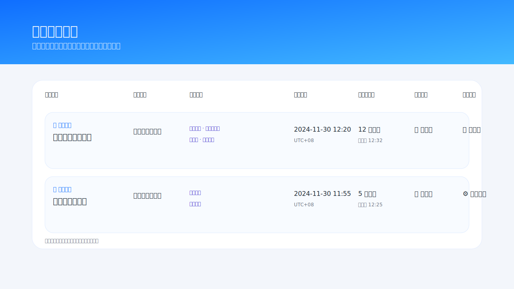

# Policy Monitor

A configurable policy intelligence monitoring platform that orchestrates website crawling, semantic matching, and alert delivery so teams can track regulatory updates with ease.

## Feature Preview

| Cockpit Overview | Task Orchestration | Result Archive |
| --- | --- | --- |
|  |  |  |

> The illustrations above highlight the primary screens: a real-time cockpit, a task center for fine-grained scheduling, and an archive view for reviewing matched items.

## Key Capabilities

- **Website management** – configure monitored domains, decide whether to follow subpages, and control frequency or proxy usage.
- **Watch list & taxonomy** – maintain reusable keywords/summaries grouped by category and attach them to multiple tasks.
- **Task orchestration** – combine sites, watch items, and notification channels, pause/resume jobs, and inspect logs in one place.
- **Crawling & diff engine** – detect newly published links, extract summaries, and score them via semantic similarity.
- **Notification channels** – built-in SMTP mailer plus an extendable DingTalk webhook integration.
- **Operations cockpit** – high-contrast dashboard visualises coverage, running jobs, and live logs at a glance.

## Technical Highlights

- **Flask + SQLAlchemy** foundation for a lightweight yet robust service that is easy to extend.
- **Pluggable NLP scoring** using `sentence-transformers` (`all-MiniLM-L6-v2`) with graceful fallback to fuzzy matching when unavailable.
- **In-app scheduler** (`MonitorScheduler`) keeps crawl jobs running in a background thread and hot-reloads proxy configuration.
- **Observability by design** with structured tables for crawl logs, notifications, and hit records.
- **Proxy & throttling support** to adapt to sites with strict rate limits.

## Architecture


## Project Layout

```
.
├── app.py               # Flask entry point and routes
├── crawler.py           # Crawl, diff, and notification logic
├── database.py          # Database session setup with env override support
├── email_utils.py       # SMTP & DingTalk helpers
├── models.py            # SQLAlchemy models
├── scheduler.py         # Background scheduler
├── templates/           # Jinja2 templates and cockpit view
├── docs/images/         # Feature preview illustrations
├── docs/previews/       # HTML mockups used for screenshots
├── requirements.txt     # Python dependencies
└── Dockerfile           # Container build script
```

## Getting Started (Local Development)

1. **Create a virtual environment & install dependencies**

   ```bash
   python3 -m venv .venv
   source .venv/bin/activate  # On Windows use .venv\Scripts\activate
   python -m pip install --upgrade pip
   python -m pip install -r requirements.txt
   ```

   Install `sentence-transformers` (plus `numpy`/`scipy`) when semantic matching accuracy is required and compatible wheels are available.

2. **Configure outbound notifications**

   Provide SMTP credentials via environment variables or edit `app.py`:

   - `SMTP_HOST`
   - `SMTP_PORT`
   - `SMTP_USERNAME`
   - `SMTP_PASSWORD`
   - `SMTP_USE_TLS` (optional, defaults to `true`)
   - `SMTP_SENDER` (optional, defaults to username)

   DingTalk webhook support is available through `send_dingtalk_message` in `email_utils.py`.

3. **Launch the development server**

   ```bash
   python -m flask --app app run
   ```

   The first launch provisions the SQLite schema, seeds sample proxies, and starts the scheduler thread.

4. **Open the UI**

   Navigate to [http://localhost:5000](http://localhost:5000) to configure websites, watch items, and monitoring tasks.

## Docker Deployment

1. **Prepare persistent folders** for the database and uploaded artefacts:

   ```bash
   mkdir -p runtime/data runtime/uploads
   ```

2. **Build the image**

   ```bash
   docker build -t policy-monitor:latest .
   ```

3. **Run the container**

   ```bash
   docker run -d \
     --name policy-monitor \
     -p 5000:5000 \
     -e FLASK_ENV=production \
     -e DATABASE_URL=sqlite:////data/data.db \
     -e SMTP_HOST=smtp.example.com \
     -e SMTP_PORT=465 \
     -e SMTP_USERNAME=notify@example.com \
     -e SMTP_PASSWORD=secret \
     -e SMTP_USE_TLS=true \
     -v $(pwd)/runtime/data:/data \
     -v $(pwd)/runtime/uploads:/uploads \
     policy-monitor:latest
   ```

   - `/data` stores the SQLite database (or another DB driver if `DATABASE_URL` is changed).
   - `/uploads` is reserved for attachments, reports, or snapshots that should live outside the container.
   - Expose additional ports with extra `-p` flags when required.

4. **Operational tips**

   - View logs with `docker logs -f policy-monitor`.
   - Rebuild and restart with the same host volumes to upgrade without losing history.

## Operations Notes

- The crawler gracefully falls back to fuzzy matching when `sentence-transformers` cannot be installed.
- Tune proxy usage and throttle intervals per-website to avoid rate limiting.
- Back up the `/data` volume regularly to prevent data loss.
- Extend `email_utils.py` or plug in new notifiers to support Slack, WeChat, or SMS.

## Roadmap Ideas

- Swap the in-process scheduler for APScheduler or Celery for distributed execution.
- Build a visual rule designer for XPath/JSONPath extraction.
- Add RBAC, tenancy separation, and audit logging for enterprise scenarios.

Contributions are welcome—feel free to open issues or pull requests!
